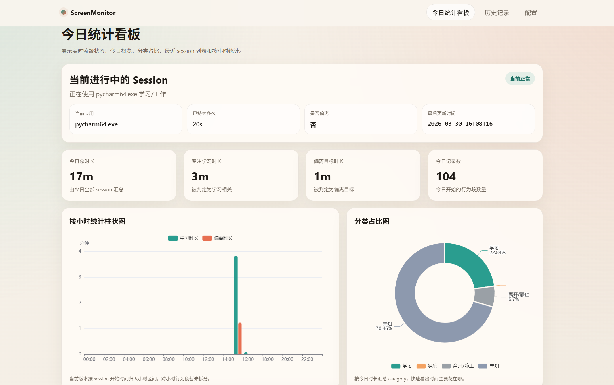

# ScreenMonitor

一个本地运行的 AI 学习/工作监督工具。它会定时截图、识别当前前台应用和窗口内容，把你的行为自动归类为 `study / entertainment / communication / idle / unknown`，并把结果写入 SQLite 与 JSONL，同时提供可视化看板页面，帮助你回顾“今天做了什么、偏离了多久、最近在干什么”。

这个 README 面向第一次接触项目的新手开发者，重点是：

- 先把项目跑起来
- 再理解项目结构
- 最后知道怎么改配置、查问题、继续开发

## 1. 项目简介

### 项目名称

ScreenMonitor

### 项目作用

这是一个本地 AI 监督工具，用来追踪电脑前的真实行为状态，并尽量自动回答下面几个问题：

- 今天总共工作/学习了多久？
- 哪些时间段是在专注做事？
- 哪些时间段偏离了当前目标？
- 最近几分钟我到底在干什么？

### 适用场景

- 自律监督
- 学习时间统计
- 开发/写作/阅读过程记录
- 回顾一天的专注时段和分心时段
- 需要本地化、可视化、可扩展的个人行为记录系统

### 解决了什么问题

普通番茄钟或手动打卡工具需要你自己开始/结束记录，容易漏记、也不够客观。  
这个项目通过“截图 + 窗口信息 + AI 分类”的方式，自动记录行为段，并把结果沉淀成：

- 实时状态卡片
- 今日看板
- 历史回顾页
- SQLite 数据库
- JSONL 备份日志

### 效果图


## 2. 功能特性

### 已实现

- 定时截图并获取当前前台应用、窗口标题
- 基于画面变化、窗口切换、空闲时间决定是否触发 AI 分析
- 支持 `Gemini -> Qwen -> Kimi` 的多级兜底分析
- 本地规则快速分类明显场景，例如 IDE、娱乐站点、聊天软件
- 自动合并相邻同类事件为 `activity_sessions`
- 把行为记录写入 `SQLite` 和 `JSONL`
- 对高置信度偏离行为保存证据截图
- 首页看板 `/`
- 历史回顾页 `/history`
- 配置页面 `/settings`
- 敏感配置本地密码保护，支持 10 分钟临时解锁
- 支持主屏截图或全屏截图
- 支持锁屏/长时间离开设备的 `idle` 事件记录

### 计划中 / 待完善

- 自动小时汇总表 `hourly_reports`
- 更稳定的通知/推送能力（如飞书）
- 更完善的配置项生效状态校验
- 自动化测试与依赖清单文件
- 更细的分类与异常事件识别

> 注意：上面的“计划中”是根据当前代码和已讨论方向整理的，不代表已经完整实现。

## 3. 技术栈

### 编程语言

- Python

### 框架与库

- FastAPI：提供本地 Web 页面和 API
- Uvicorn：启动 FastAPI 服务
- Loguru：日志输出
- Pillow：图像处理
- MSS：屏幕截图
- psutil：进程信息获取
- pywin32：Windows 前台窗口、输入空闲时间检测
- google-genai：Gemini 调用
- openai：Qwen / Kimi 的兼容模式调用
- PyYAML：读取和写入配置文件

### 数据库

- SQLite（本地文件 `supervisor.db`）

### 部署环境

- 本地 Windows 桌面环境

> 注意：当前采集逻辑依赖 Windows API，因此本项目不是通用跨平台桌面监控方案。

## 4. 项目结构说明

下面是当前项目里最关键的文件：

```text
ScreenMonitor/
├─ main.py                  # 项目主入口：启动 FastAPI、启动采集线程、提供看板和配置 API
├─ collector.py             # 采集器：截图、窗口检测、空闲判定、AI 触发逻辑
├─ ai_router.py             # AI 路由：Gemini -> Qwen -> Kimi，多模型兜底与解析
├─ storage.py               # 数据存储：SQLite 写入、session 合并、JSONL 备份
├─ config.yaml              # 当前实际生效的配置文件
├─ config_example.yaml      # 示例配置，适合参考和初始化
├─ supervisor.db            # SQLite 数据库文件
├─ study_log.jsonl          # JSONL 行日志备份
├─ admin_auth.json          # 配置页本地管理密码哈希
├─ web_app.py               # 兼容入口，当前主要转向 main.app
├─ templates/
│  ├─ dashboard.html        # 今日看板页面
│  ├─ history.html          # 历史回顾页面
│  └─ settings.html         # 配置页面
├─ logs/                    # 每日日志文件
└─ anomaly_screenshots/     # 偏离行为证据截图
```

### 新手注意

#### `collector.py`

这是“采样器”。它每隔几秒截图一次，判断：

- 当前是否切换了窗口
- 屏幕是否明显变化
- 键鼠是否长时间没有输入

然后决定要不要交给 AI 分析。

#### `ai_router.py`

这是“判断器”。它负责：

- 调用 Gemini
- Gemini 失败时切 Qwen
- Qwen 失败时切 Kimi
- 把模型输出解析为统一结构
- 最后交给 `storage.py` 落库

#### `storage.py`

这是“记账器”。它会把多次连续的同类行为合并成一个 session，避免每 5 秒就插一条碎记录。

#### `main.py`

这是“总控入口”。它把：

- Web 服务
- AI 路由
- 数据存储
- 采集线程

全部组装起来，所以一般直接运行它就够了。

## 5. 环境要求

### 操作系统

- Windows 10 / Windows 11

### Python 版本

- 推荐 `Python 3.11` 或 `Python 3.12`
- 当前项目环境里已验证 `Python 3.12`

### 包管理器

- `pip`

### 数据库 / 中间件

- 不需要单独安装数据库
- SQLite 使用本地文件，Python 自带支持

### 其他前置条件

- 需要可正常截图的桌面环境
- 需要可访问外部 AI 服务的网络
- 至少准备一个可用模型的 API Key
  - Gemini 必填，或
  - Qwen / Kimi 至少准备一个兜底

> 注意：Qwen 兜底当前接的是视觉理解模型（如 `qwen-vl-plus`），不是图片生成模型。

## 6. 安装步骤

### 第一步：获取项目代码

如果你已经在本地有项目目录，可以跳过。

```powershell
git clone <仓库地址>
cd ScreenMonitor
```

### 第二步：创建虚拟环境

```powershell
python -m venv .venv
```

### 第三步：激活虚拟环境

PowerShell：

```powershell
.venv\Scripts\Activate.ps1
```

如果提示执行策略限制，可以先执行：

```powershell
Set-ExecutionPolicy -Scope Process -ExecutionPolicy Bypass
```

然后再激活：

```powershell
.venv\Scripts\Activate.ps1
```

### 第四步：安装依赖

当前仓库里**没有** `requirements.txt` 或 `pyproject.toml`，因此需要手动安装。

```powershell
pip install fastapi uvicorn pyyaml loguru mss psutil pillow pywin32 google-genai openai
```

> 注意：这一步后续建议补一个正式的依赖文件。当前 README 里的安装命令是根据代码实际 import 整理出来的。

### 第五步：准备配置文件

如果你想从示例配置开始：

```powershell
Copy-Item config_example.yaml config.yaml
```

如果仓库里已经有 `config.yaml`，可以直接编辑它。

### 第六步：填写 API Key

打开 `config.yaml`，至少填写下面其中一部分：

- `api_keys.gemini`
- `api_keys.qwen`
- `api_keys.kimi`

建议优先顺序：

1. Gemini
2. Qwen
3. Kimi

### 第七步：确认数据库文件

第一次启动时如果没有数据库，会自动创建 `supervisor.db`。  
你不需要手动建表。

## 7. 快速开始

如果你只想最快把项目跑起来，请按下面做：

### 最短上手路径

1. 进入项目目录
2. 激活虚拟环境
3. 安装依赖
4. 填 `config.yaml` 的 API Key
5. 启动 `main.py`

直接可复制命令如下：

```powershell
cd C:\Users\Fang\PycharmProjects\ScreenMonitor
.venv\Scripts\Activate.ps1
python main.py
```

### 启动后访问地址

浏览器打开：

```text
http://127.0.0.1:8000/
```

你会看到：

- 首页看板：`/`
- 历史页：`/history`
- 配置页：`/settings`

### 启动成功的预期结果

- 终端出现 FastAPI/Uvicorn 启动日志
- `logs/` 下生成当日日志文件
- `supervisor.db` 自动创建或更新
- 页面能看到实时状态、今日概览、历史记录等内容

## 8. 配置说明

项目主要使用 `config.yaml`。

### 示例配置

下面给一个适合新手理解的精简示例：

```yaml
capture:
  interval_seconds: 5
  scale_percent: 50
  target_screen: "main"
  format: "jpg"
  quality: 70

triggers:
  min_ai_interval_seconds: 3
  trigger_on_window_switch: true
  static_screen_threshold: 2.0
  no_input_suspect_seconds: 180
  static_recheck_ai_seconds: 300
  away_from_keyboard_seconds: 600

ai_models:
  primary: "gemini-2.5-flash"
  qwen_fallback_model: "qwen-vl-plus"
  fallback: "kimi-k2.5"
  timeout_seconds: 20
  max_retries: 2
  low_confidence_threshold: 0.7

context:
  current_goal: "完成 Python 自动化工具开发"

api_keys:
  gemini: "你的 Gemini Key"
  qwen: "你的 Qwen Key"
  kimi: "你的 Kimi Key"
```

### 关键配置项说明

#### `capture`

- `interval_seconds`：截图间隔，单位秒
- `scale_percent`：截图缩放比例，越小越省资源
- `target_screen`：
  - `main` 表示主屏
  - `all` 表示所有屏幕拼接后的全屏
- `format`：截图压缩格式，推荐 `jpg`
- `quality`：图片质量，影响传输体积和可读性

#### `triggers`

- `min_ai_interval_seconds`：两次 AI 分析最小间隔
- `trigger_on_window_switch`：切换窗口时是否立即分析
- `static_screen_threshold`：屏幕差异低于这个值时，认为画面静止
- `no_input_suspect_seconds`：长时间无输入，标记为疑似停滞
- `static_recheck_ai_seconds`：静止画面多久强制复查一次
- `away_from_keyboard_seconds`：多久判定为长时间离开

#### `ai_models`

- `primary`：主模型，当前默认 Gemini
- `qwen_fallback_model`：Qwen 兜底模型，建议 `qwen-vl-plus`
- `fallback`：Kimi 兜底模型
- `timeout_seconds`：模型请求超时
- `max_retries`：每个模型失败后的重试次数
- `low_confidence_threshold`：低于这个置信度就进入下一级兜底

#### `context`

- `current_goal`：你当前的学习/工作目标，AI 会据此判断是否偏离

#### `api_keys`

- `gemini`：Gemini API Key
- `qwen`：Qwen / DashScope API Key
- `kimi`：Kimi API Key

### 配置页说明

你也可以在浏览器里打开：

```text
http://127.0.0.1:8000/settings
```

这里可以直接改普通配置。  
敏感配置（例如 API Key）需要先输入本地管理密码解锁。

## 9. 使用示例

### 页面使用示例

#### 1. 查看今天的统计

打开：

```text
http://127.0.0.1:8000/
```

你可以看到：

- 当前进行中的 session
- 今日总时长
- 学习时长
- 偏离时长
- 小时图
- 分类占比图
- 最近 session 列表

#### 2. 查看历史某一天

打开：

```text
http://127.0.0.1:8000/history
```

选择日期后可以看到：

- 当天概览
- 当天小时图
- 分类占比
- session 列表

### API 使用示例

#### 健康检查

```powershell
curl http://127.0.0.1:8000/api/health
```

#### 获取今日概览

```powershell
curl http://127.0.0.1:8000/api/dashboard/summary
```

#### 获取最近 session

```powershell
curl "http://127.0.0.1:8000/api/dashboard/recent?limit=20"
```

#### 获取指定日期历史

```powershell
curl "http://127.0.0.1:8000/api/dashboard/history?date=2026-03-26"
```

#### 获取配置结构

```powershell
curl http://127.0.0.1:8000/api/settings/schema
```

## 10. 开发说明

### 本地开发启动

```powershell
.venv\Scripts\Activate.ps1
python main.py
```

### 语法检查

```powershell
python -m py_compile main.py collector.py ai_router.py storage.py
```

### 手动接口调试

仓库里有一个简单的 HTTP 调试文件：

- [test_main.http](C:/Users/Fang/PycharmProjects/ScreenMonitor/test_main.http)

不过这个文件目前内容较旧，建议后续同步更新。

### 代码规范

当前仓库**未看到**自动化 lint / formatter 配置，状态为“待补充”。  
建议至少保持：

- 模块职责清晰
- 配置项和代码行为保持一致
- 新增接口时同步更新设置页/README
- 修改 AI 逻辑时同步关注 fallback 和日志

### 提交规范

当前仓库**未看到**明确的 Git 提交规范，状态为“待确认”。  
建议后续统一成 Conventional Commits，例如：

```text
feat: add qwen fallback
fix: avoid event loop closed on shutdown
docs: rewrite README for quick start
```

## 11. 常见问题 FAQ

### 问题：安装 `pywin32` 失败

原因：当前环境不是 Windows，或者 Python 版本/架构不匹配。  
解决办法：

- 确认你在 Windows 上运行
- 使用 64 位 Python
- 升级 `pip`

```powershell
python -m pip install --upgrade pip
pip install pywin32
```

### 问题：打开 `http://127.0.0.1:8000/` 失败

原因：服务没有启动，或者 8000 端口被占用。  
解决办法：

1. 先确认你已经运行：

```powershell
python main.py
```

2. 如果端口占用，先找占用进程：

```powershell
netstat -ano | findstr :8000
```

### 问题：页面能打开，但没有最新数据

原因：

- 采集线程没有正常工作
- 当前没有触发新的 session
- 历史旧数据的 `duration_seconds` 可能仍为 0

解决办法：

- 看终端和 `logs/` 是否持续输出采集日志
- 切换窗口或进行实际操作，触发新 session
- 检查 `activity_sessions` 是否有新记录

### 问题：Gemini 经常报 SSL EOF

原因：常见于网络不稳定、代理、TLS 连接异常。  
解决办法：

- 检查网络与代理
- 使用 Qwen / Kimi 兜底
- 增大 `timeout_seconds`
- 查看 `logs/system_*.log`

### 问题：Gemini 失败后没有得到有效结果

原因：可能是 Qwen/Kimi 返回空内容、非 JSON、或模型不适合图像理解。  
解决办法：

- 优先使用视觉理解模型，例如 `qwen-vl-plus`
- 不要把 `qwen-image-2.0-pro` 当作当前分类兜底模型
- 查看日志中是否有：
  - `Qwen 原始 content`
  - `Kimi 原始 content`
  - `解析 AI JSON 输出失败`

### 问题：出现 `Event loop is closed`

原因：应用关闭时，采集线程还在往已关闭的事件循环投递事件。  
解决办法：

- 使用当前版本代码，已加关闭保护
- 避免频繁强制结束进程

### 问题：配置页提示未解锁

原因：敏感设置需要本地管理密码。  
解决办法：

- 第一次进入时先初始化密码
- 后续通过密码解锁 10 分钟
- 关闭页面后令牌会失效，这是正常行为

### 问题：数据库连接失败 / 文件损坏

原因：

- 数据库文件被占用
- 非正常中断
- 手动改坏了文件

解决办法：

- 先备份 `supervisor.db`
- 检查文件是否被其他工具占用
- 必要时删除数据库重新启动自动建表

> 注意：删除数据库前请先备份。

## 12. 部署说明

### 本地部署

当前最推荐的方式就是本地 Windows 机器直接运行：

```powershell
.venv\Scripts\Activate.ps1
python main.py
```

然后访问：

```text
http://127.0.0.1:8000/
```

### 服务器部署

当前状态：**不推荐当作普通 Linux 服务器项目直接部署**。  
原因是采集器依赖 Windows 前台窗口和输入检测 API。

如果你必须部署到服务器，请先区分两件事：

- Web 看板服务是否单独拆分
- 桌面采集器是否继续只在 Windows 客户端运行

这部分当前项目里**还没有**完整拆分，状态为“待扩展”。

## 13. 后续计划

- 补全依赖文件（`requirements.txt` 或 `pyproject.toml`）
- 增加自动化测试
- 增加小时汇总持久化表
- 增加通知/日报能力
- 优化多模型输出解析稳定性
- 明确哪些配置项“立即生效 / 重启生效 / 尚未实现”
- 拆分采集器与 Web 服务，降低耦合

## 14. License

当前仓库**未看到明确 License 文件**，状态为“需补充”。

如果你准备公开到 GitHub，建议补一个明确的许可证，例如：

- MIT
- Apache-2.0
- GPL-3.0

## 15. 联系方式 / 贡献方式

### 贡献方式

如果你准备继续开发，建议优先从下面几类问题入手：

- 配置项实际生效状态梳理
- 模型输出解析稳定性
- 小时汇总与报表性能
- 单元测试和依赖清单
- README / API 文档同步维护

### 联系方式

当前仓库**未提供公开联系方式**，状态为“需补充”。

如果你准备放到 GitHub 首页，建议至少补一个：

- GitHub Issues
- 邮箱
- 个人主页

---

如果你只想先跑起来，请记住最短命令：

```powershell
cd C:\Users\Fang\PycharmProjects\ScreenMonitor
.venv\Scripts\Activate.ps1
python main.py
```

然后打开：

```text
http://127.0.0.1:8000/
```

先看到页面，再回头慢慢理解 `collector.py -> ai_router.py -> storage.py -> main.py` 这条主链路，会快很多。
